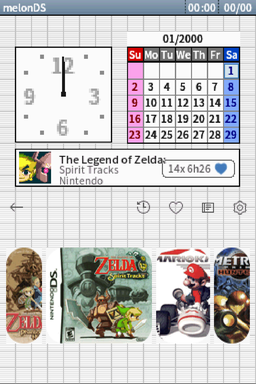
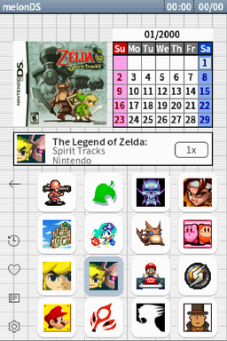
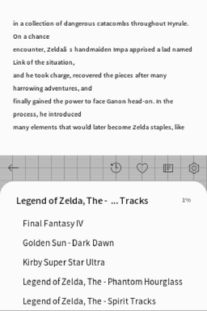

# Pico Launcher Enhanced

> [!NOTE]
> This is an **altered version** of [Pico Launcher Enhanced](https://github.com/rasalopa/pico-launcher-enhanced)
> by rasalopa, modified by RetroModLab. It is not the original software and the
> original authors are not responsible for it. Changes: the app bar's delete button
> is a guides button that opens the guide reader on the highlighted game's guide,
> the brightness setting drives the MCU on a DSi so it works there too, themes can
> pin individual Material colors, and there is a new `dsbios` theme type that draws
> the Nintendo DS home screen in code.

A feature fork of [Pico Launcher](https://github.com/LNH-team/pico-launcher) by the LNH team, adding library features inspired by modern consoles — favorites, play stats, recently played, and more — while staying fully compatible with stock SD cards: it is a drop-in `_picoboot.nds` replacement, and all upstream features remain intact.




## Download

**[Download PicoLauncher-DSBIOS.zip](https://github.com/djaysan/pico-launcher-dsbios/releases/latest/download/PicoLauncher-DSBIOS.zip)**

Unzip it and copy the two items to the **root of your SD card**:

```
_picoboot.nds      replaces the launcher
_pico/             adds the DS BIOS theme (merge with the folder already
                   there - do not delete it)
```

Put the card back in the flashcart and turn the DS on. To switch to the theme:
**gear → paintbrush → DS BIOS**.

Your games, saves, covers and settings are untouched, and you can go back to the
stock launcher any time by restoring the old `_picoboot.nds`.

## Guides on the top screen



Put plain text walkthroughs in a `/guides` folder at the root of the card, named
after the ROM — `Chrono Trigger.nds` is documented by `/guides/Chrono Trigger.txt`.
The book button in the app bar then opens that game's guide on the top screen,
streamed a screenful at a time so a 1.4 MB walkthrough works on 4 MB of RAM. Your
place is remembered per guide.

### Getting the guides onto the card

You do not have to hunt those files down one by one:

**[guides.retromodlab.com/app](https://guides.retromodlab.com/app/)**

It reads your ROM folder, matches it against 17,400 games across 100 platforms,
and writes the walkthroughs straight onto the card with the right filenames.
Nothing is uploaded and no guide content is hosted — it fetches from archive.org
and writes to your card, in the browser. Needs Chrome or Edge, for the File
System Access API.

Reading guides in-game on other handhelds is a separate project:
**[Guide Watch](https://github.com/djaysan/guide-watch)**.

## Features

Everything upstream Pico Launcher offers (display modes, [covers](docs/Covers.md), [custom icons & banners](docs/Customization.md), [themes](docs/Themes.md), [cheats](docs/Cheats.md), [file associations](docs/FileAssociations.md) — see [Usage](docs/Usage.md)), plus:

- **Game count** of the current folder on the top screen
- **Random game launch** with the SELECT button
- **Favorites** — press X on a game; a heart shows on the top screen
- **Favorites filter** — heart button in the app bar, tinted while active
- **Recently played panel** — clock button in the app bar; tapping an entry jumps to the game
- **Statistics panel** — press START for totals and most-played games
- **Per-game launch tracking** — launch count and last-played date on the top screen
- **Approximate play time** — per game and in the statistics panel
- **Guides** — book button in the app bar; opens the guide reader on the highlighted game's guide (replaces upstream's game deletion)
- **Brightness control** — set the backlight level from display settings (DS Lite and DSi)
- **Per-folder background music** — drop a `bgm.bcstm` inside a folder
- **Time-of-day theme backgrounds** — optional night variants shown from 20:00 to 6:59
- **DS BIOS theme type** — an analog clock, month calendar and status bar drawn in code, so the DS home screen look is a theme rather than a fork
- **Themeable Material roles** — a `colors` block in `theme.json` pins exact colors instead of accepting everything the seed derives
- **Per-file game data** — favorites and play stats belong to the ROM file, so two copies of a game never share them

See [Enhanced features](docs/Enhanced.md) for details on each feature.

## Installation

1. Download `LAUNCHER.nds` from the [Releases](../../releases) page.
2. Rename it to `_picoboot.nds` and place it in the root of your SD card, replacing the existing one.

No other changes to your SD card are needed — themes, covers and the `_pico` folder from a stock setup keep working as-is.

> [!NOTE]
> To use Pico Launcher, the Pico Loader files (`aplist.bin`, `savelist.bin`, `picoLoader7.bin` and `picoLoader9.bin`) must also be present in the `/_pico` folder on your SD card.

## Setup & Configuration
We recommend using WSL (Windows Subsystem for Linux), or MSYS2 to compile this repository.
The steps provided will assume you already have one of those environments set up.

1. Install [BlocksDS](https://blocksds.skylyrac.net/docs/setup/)
2. Fetch the submodules: `git submodule update --init`

## Compiling

1. Run `make`

Alternatively, build with Docker (the same image used by CI) without installing BlocksDS locally:

```sh
docker run --rm -v "$PWD":/work -w /work skylyrac/blocksds:slim-v1.16.0 make
```

The launcher can be found in the root directory under the name `LAUNCHER.nds`.

2. Copy `LAUNCHER.nds` to your SD card.
    - If you are using DSpico, rename to `_picoboot.nds` and place it in the root of your SD card.
3. Copy the `_pico` pico folder to the root of your SD card.

For DSpico the final directory structure will look like this:
```
.
├── _pico
│   ├── themes
│   │   ├── material
│   │   │   └── theme.json
│   │   └── raspberry
│   │       ├── bannerListCell.bin
│   │       ├── bannerListCellPltt.bin
│   │       ├── bannerListCellSelected.bin
│   │       ├── bannerListCellSelectedPltt.bin
│   │       ├── bottombg.bin
│   │       ├── gridcell.bin
│   │       ├── gridcellPltt.bin
│   │       ├── gridcellSelected.bin
│   │       ├── gridcellSelectedPltt.bin
│   │       ├── scrim.bin
│   │       ├── scrimPltt.bin
│   │       ├── theme.json
│   │       └── topbg.bin
│   ├── aplist.bin
│   ├── savelist.bin
│   ├── picoLoader7.bin
│   └── picoLoader9.bin
└── _picoboot.nds
```
Note: If you want to play DSiWare on the DSpico, additional files are required. See the [Pico Loader](https://github.com/LNH-team/pico-loader) readme for more information.

## Extra tools

The [`tools/`](tools/) directory contains desktop helper scripts for preparing SD card content — cover art converters and fetchers, banner and icon generators, and night background makers. See [Tools](docs/Tools.md).

## Data formats

The fork stores per-game data (favorites, launch counts, play time) in `/_pico/gamedata.json`. Each entry belongs to one ROM file — if a favorite or a play count is not where you expect it, [Data storage](docs/Enhanced.md#data-storage) explains why in a table. The file format itself is documented in [Game data](docs/GameData.md) for tool authors.

## Contributing

Bug reports, ideas and pull requests are welcome — see [CONTRIBUTING.md](CONTRIBUTING.md).

## License

Icons by [icons8](https://icons8.com/)

This project is licensed under the Zlib license. For details, see `LICENSE.txt`.

Additional licenses may apply to the project. For details, see the `license` directory.

## Credits

- The **LNH team** for [Pico Launcher](https://github.com/LNH-team/pico-launcher), the launcher all of this is built on, and for the Material and Raspberry themes it ships with.
- **[rasalopa](https://github.com/rasalopa/pico-launcher-enhanced)** for the feature fork this one is based on — favorites, play stats, recently played and the rest of the library features.
- **Lohkas** for the original DS BIOS theme. He built the look by hardcoding a modified launcher; the `dsbios` theme type here is a rebuild of it as a proper theme, so it keeps every feature above.

## Contributors
- [@Gericom](https://github.com/Gericom)
- [@XLuma](https://github.com/XLuma)
- [@Dartz150](https://github.com/Dartz150)
- [@lifehackerhansol](https://github.com/lifehackerhansol)

All credit for the launcher's foundation goes to the LNH team — this fork only builds on their excellent work.

---

This fork is free. If the DS BIOS theme put a clock back on your home screen, you can buy me a coffee:

[](https://ko-fi.com/H2H81I6YY1)
